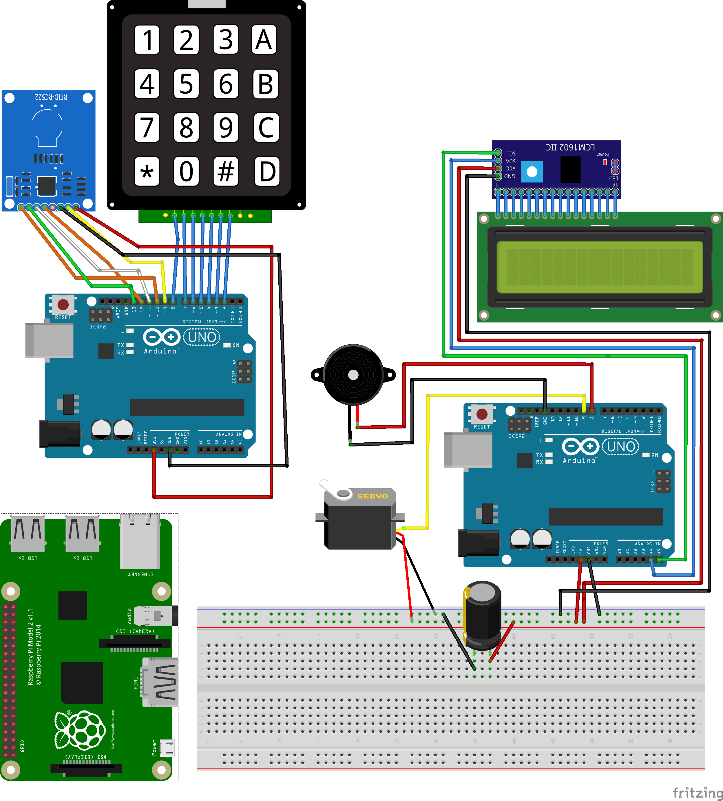

# sed-raspduino
Double authentication system with RFID and password using 2 Arduino Uno boards and a Raspberry Pi 2. It was developed in the context of the master's subject Distributed Embedded Systems. In this repository you will find the base code of the systems and links to the required libraries used to interact with the various sensors.

## System design

## Materials:

We used the following components::

- 1x Raspberry 2.
- 2x Arduino Uno rev. 2.
- LCD via I2C.
- Matrix keyboard.
- RFID sensor.
- Servo.
- LEDs.
- Buzzer.

## Libraries:

- LCD, it is zipped in the following dir "LCD_I2C/". [Link to git](https://github.com/fdebrabander/Arduino-LiquidCrystal-I2C-library)
- RFID, [library](https://github.com/AritroMukherjee/RFID/blob/master/rfid-master.zip)
- Matrix keyboard, [KOOKYE library (builder)](http://osoyoo.com/wp-content/uploads/2016/07/Keypad.rar)
