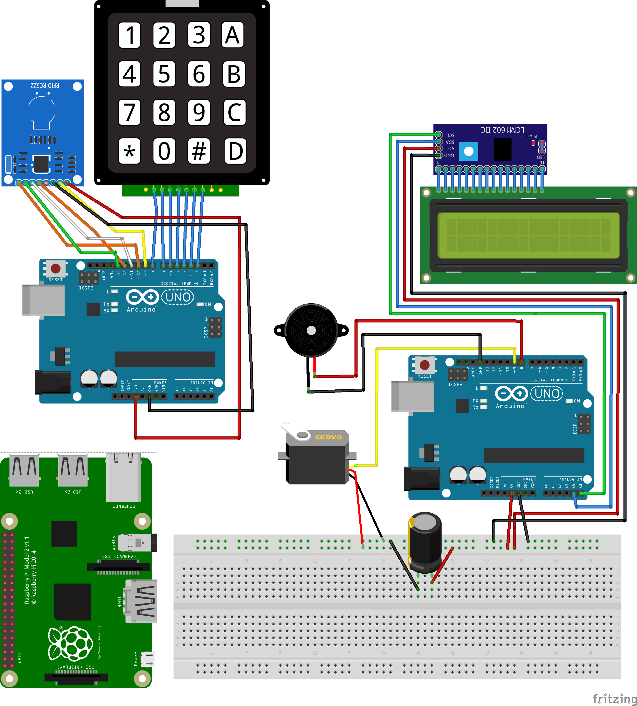

# sed-raspduino
Proyecto que comunica dos Arduinos y una Raspberry para implementar un sistema de doble autenticación usando un lector RFID y contraseñas. Fue realizado para la asignatura Sistemas Empotrados Distribuidos. En el repo hay una serie de códigos base y luego los archivos que juntaran varias librerias para usar en las diferentes dispositivos.

## Diseño del sistema

## Componentes usados:

Usamos los siguientes componentes:

- 1x Raspberry 2.
- 2x Arduino Uno rev. 2.
- LCD comunicado por I2C.
- Teclado matricial.
- Sensor RFID.
- Servomotor.
- LEDs.
- Zumbador.

## Librerias necesarias:

- LCD, se encuentra comprimida en el directorio de LCD_I2C/. [Enlace a git](https://github.com/fdebrabander/Arduino-LiquidCrystal-I2C-library)
- RFID, [liberia](https://github.com/AritroMukherjee/RFID/blob/master/rfid-master.zip)
- Teclado Matricial, [liberia de KOOKYE (fabricante)](http://osoyoo.com/wp-content/uploads/2016/07/Keypad.rar)
